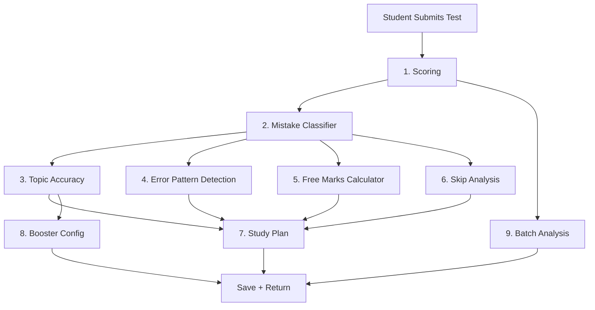

> [!WARNING]
> **DEPRECATED**: This document describes the legacy v2 engine. The current implemented standard is v3. Please refer to `analysis-engine-v3.md` for the current architecture.

# Analysis Engine v2 — Unified Blueprint

> Zero AI. Pure logic. <50ms. ₹0/month.

## Pipeline Architecture



**9 stages, all deterministic, all running in a single `analyzeAttempt()` call.**

---

## Stage 1: Scoring

```typescript
// services/scoring.service.ts — unchanged from v1
function scoreAttempt(answers: AttemptAnswer[], scheme: MarkingScheme): ScoringResult {
  let score = 0, correct = 0, incorrect = 0, skipped = 0;
  for (const ans of answers) {
    if (!ans.selected_answer) { score += scheme.unattempted; skipped++; }
    else if (ans.is_correct) { score += scheme.correct; correct++; }
    else { score += scheme.incorrect; incorrect++; }
  }
  return { score, maxScore: answers.length * scheme.correct,
    percentage: (score / (answers.length * scheme.correct)) * 100,
    correctCount: correct, incorrectCount: incorrect, skippedCount: skipped };
}
```

---

## Stage 2: Mistake Classifier ⭐ (NEW — the core differentiator)

Two layers: **distractor map** (high confidence) → **heuristic fallback** (medium confidence).

### Types

```typescript
// services/analysis/mistake-classifier.ts

type ErrorType = "conceptual" | "calculation" | "silly" | "partial_solve"
              | "sign_error" | "wrong_method" | "misread";
type SkipType  = "didnt_know" | "couldnt_solve" | "ran_out_of_time" | "strategic_skip";

interface MistakeClassification {
  type: ErrorType | SkipType | "correct";
  detail: string;
  tip: string;
  confidence: "high" | "medium" | "low";
}
```

### Main classifier

```typescript
function classifyMistake(ans: AnswerWithQuestion): MistakeClassification {
  if (ans.is_correct) return { type: "correct", detail: "", tip: "", confidence: "high" };
  if (!ans.selected_answer) return classifySkip(ans);

  // Layer 1: Distractor map (teacher-tagged, 90%+ accurate)
  const distractor = ans.distractor_map?.[ans.selected_answer];
  if (distractor) {
    return {
      type: distractor.error_type,
      detail: distractor.trap_description,
      tip: distractor.common_mistake,
      confidence: "high",
    };
  }

  // Layer 2: Time + behavior heuristics (~70% accurate)
  return classifyByHeuristics(ans);
}
```

### Heuristic fallback (4 rules)

```typescript
function classifyByHeuristics(ans: AnswerWithQuestion): MistakeClassification {
  const t = ans.time_taken_sec;
  const avgT = getAvgTimeForDifficulty(ans.difficulty);

  // Rule 1: Very fast + wrong → misread/silly
  if (t < avgT * 0.3)
    return { type: "silly", detail: "Answered unusually fast", tip: "Read fully before answering.", confidence: "medium" };

  // Rule 2: Very slow + wrong → conceptual gap
  if (t > avgT * 2)
    return { type: "conceptual", detail: "Spent 2x+ avg time", tip: "Revise this topic from basics.", confidence: "medium" };

  // Rule 3: Marked for review + wrong → uncertain = conceptual
  if (ans.marked_review)
    return { type: "conceptual", detail: "Flagged for review — low confidence", tip: "You weren't sure of the approach.", confidence: "medium" };

  // Rule 4: Easy Q + normal time + wrong → likely calculation
  if (ans.difficulty === "easy" && t > avgT * 0.5)
    return { type: "calculation", detail: "Easy Q wrong at normal pace", tip: "Double-check arithmetic.", confidence: "low" };

  return { type: "conceptual", detail: "Could not auto-classify", tip: "Review the solution.", confidence: "low" };
}
```

### Skip classifier (3 types)

```typescript
function classifySkip(ans: AnswerWithQuestion): MistakeClassification {
  const t = ans.time_taken_sec;
  if (t < 3)  return { type: "ran_out_of_time", detail: "Never reached this question", tip: "Don't spend >3 min on any Q.", confidence: "high" };
  if (t < 15) return { type: "didnt_know", detail: "Glanced and moved on", tip: `Revise ${ans.chapter}.`, confidence: "medium" };
  if (t > 60) return { type: "couldnt_solve", detail: "Spent time but gave up", tip: "Practice multi-step problems.", confidence: "medium" };
  return { type: "strategic_skip", detail: "Reasonable skip", tip: "", confidence: "high" };
}
```

---

## Stage 3: Topic Accuracy (enhanced with error-type breakdown)

```typescript
// services/analysis/topic-accuracy.ts

interface TopicStat {
  chapter: string;
  topic: string;
  attempted: number;
  correct: number;
  accuracy: number;
  avgTimeSec: number;
  difficulty: string;
  isWeak: boolean;
  // NEW: per-topic error breakdown
  errorBreakdown: { conceptual: number; calculation: number; silly: number; partial_solve: number };
}

function computeTopicAccuracy(
  classifiedAnswers: ClassifiedAnswer[],  // answers with mistake classification attached
  batchAvgByTopic?: Map<string, number>
): TopicStat[] {
  const groups = groupBy(classifiedAnswers, a => `${a.chapter}::${a.topic}`);
  return Object.entries(groups).map(([key, group]) => {
    const [chapter, topic] = key.split("::");
    const attempted = group.filter(a => a.selected_answer !== null).length;
    const correct = group.filter(a => a.is_correct).length;
    const accuracy = attempted > 0 ? (correct / attempted) * 100 : 0;
    const batchAvg = batchAvgByTopic?.get(key) ?? 60;

    // Count error types within this topic
    const errors = group.filter(a => !a.is_correct && a.selected_answer);
    const breakdown = {
      conceptual: errors.filter(e => e.classification.type === "conceptual").length,
      calculation: errors.filter(e => e.classification.type === "calculation").length,
      silly: errors.filter(e => e.classification.type === "silly").length,
      partial_solve: errors.filter(e => e.classification.type === "partial_solve").length,
    };

    return {
      chapter, topic, attempted, correct, accuracy,
      avgTimeSec: avg(group.map(a => a.time_taken_sec)),
      difficulty: mode(group.map(a => a.difficulty)),
      isWeak: accuracy < 50 || accuracy < batchAvg - 15,
      errorBreakdown: breakdown,
    };
  }).sort((a, b) => a.accuracy - b.accuracy);
}
```

---

## Stage 4: Error Pattern Detection (8 detectors, up from 5)

```typescript
// services/analysis/error-patterns.ts

// Original 5 detectors (unchanged)
// 1. detectCarelessErrors      — wrong on easy, right on hard (same chapter)
// 2. detectTimePressure        — accuracy drops >25% in last quartile
// 3. detectBlindSpot           — 0% accuracy on topic with 3+ Qs
// 4. detectExcessiveSkipping   — >30% questions skipped
// 5. detectSlowSolver          — high accuracy but >3 min/question avg

// NEW 3 detectors from mistake classification research:

// 6. Subject Avoidance — disproportionately skips one subject
const detectSubjectAvoidance: PatternDetector = (answers) => {
  const bySubject = groupBy(answers, "subject");
  for (const [subject, group] of Object.entries(bySubject)) {
    const skipRate = group.filter(a => !a.selected_answer).length / group.length;
    if (skipRate > 0.5 && group.length >= 5) {
      return {
        id: "subject_avoidance", name: `Avoiding ${subject}`,
        description: `You skipped ${(skipRate * 100).toFixed(0)}% of ${subject} questions.`,
        questionsAffected: group.filter(a => !a.selected_answer).map(a => a.question_id),
        severity: "high",
        tip: `You may be afraid of ${subject}. Start with easy problems to build confidence.`,
      };
    }
  }
  return null;
};

// 7. Distractor Trap Victim — repeatedly falls for same trap type
const detectDistractorPattern: PatternDetector = (classifiedAnswers) => {
  const trapCounts: Record<string, number> = {};
  for (const a of classifiedAnswers) {
    if (a.classification?.confidence === "high" && a.classification.type !== "correct") {
      trapCounts[a.classification.type] = (trapCounts[a.classification.type] || 0) + 1;
    }
  }
  const worst = Object.entries(trapCounts).sort((a, b) => b[1] - a[1])[0];
  if (!worst || worst[1] < 3) return null;

  const LABELS: Record<string, string> = {
    partial_solve: "Stopping at intermediate steps",
    sign_error: "Sign/direction errors",
    formula_inversion: "Formula inversions",
    wrong_method: "Using wrong method",
  };
  return {
    id: "distractor_trap", name: LABELS[worst[0]] || `Repeated ${worst[0]} errors`,
    description: `You fell for "${worst[0]}" traps ${worst[1]} times in this test.`,
    questionsAffected: [],
    severity: worst[1] >= 5 ? "high" : "medium",
    tip: `Before submitting, ask: "Did I complete ALL steps?" and "Is the sign correct?"`,
  };
};

// 8. Free Marks Leak — easy/medium Qs lost to silly/calc errors
const detectFreeMarksLeak: PatternDetector = (classifiedAnswers) => {
  const leaks = classifiedAnswers.filter(a =>
    (a.difficulty === "easy" || a.difficulty === "medium") &&
    (a.classification?.type === "silly" || a.classification?.type === "calculation")
  );
  if (leaks.length < 2) return null;
  return {
    id: "free_marks_leak", name: "Free Marks Lost to Fixable Errors",
    description: `${leaks.length} easy/medium questions lost to silly or calculation errors.`,
    questionsAffected: leaks.map(a => a.question_id),
    severity: leaks.length >= 5 ? "high" : "medium",
    tip: "These are your easiest score gains. Slow down on easy questions.",
  };
};
```

---

## Stage 5: Free Marks Calculator ⭐ (NEW)

```typescript
// services/analysis/free-marks.ts

interface FreeMarksResult {
  totalFreeMarks: number;        // marks recoverable
  sillyCount: number;
  calculationCount: number;
  projectedScore: number;        // score if these were correct
  projectedPercentage: number;
  message: string;               // "Your score jumps from 156 to 216"
}

function calculateFreeMarks(
  classifiedAnswers: ClassifiedAnswer[],
  scoring: ScoringResult,
  scheme: MarkingScheme
): FreeMarksResult {
  const silly = classifiedAnswers.filter(a => a.classification?.type === "silly");
  const calc = classifiedAnswers.filter(a => a.classification?.type === "calculation");
  const fixable = silly.length + calc.length;

  // Each fixable error: gain +correct marks AND avoid -incorrect penalty
  const marksPerFix = scheme.correct + Math.abs(scheme.incorrect); // +4 - (-1) = +5 per Q
  const totalFree = fixable * marksPerFix;
  const projected = scoring.score + totalFree;

  return {
    totalFreeMarks: totalFree,
    sillyCount: silly.length,
    calculationCount: calc.length,
    projectedScore: projected,
    projectedPercentage: (projected / scoring.maxScore) * 100,
    message: `Fix ${fixable} silly+calc errors → score jumps from ${scoring.score} to ${projected}`,
  };
}
```

---

## Stage 6: Skip Analysis ⭐ (NEW)

```typescript
// services/analysis/skip-analysis.ts

interface SkipAnalysis {
  totalSkipped: number;
  didntKnow: number;         // conceptual gap
  couldntSolve: number;      // partial understanding
  ranOutOfTime: number;      // time management
  strategicSkip: number;     // smart decision
  subjectBreakdown: Record<string, { skipped: number; total: number; skipRate: number }>;
  recommendation: string;
}

function analyzeSkips(classifiedAnswers: ClassifiedAnswer[]): SkipAnalysis {
  const skips = classifiedAnswers.filter(a => !a.selected_answer);
  const byType = {
    didntKnow: skips.filter(a => a.classification?.type === "didnt_know").length,
    couldntSolve: skips.filter(a => a.classification?.type === "couldnt_solve").length,
    ranOutOfTime: skips.filter(a => a.classification?.type === "ran_out_of_time").length,
    strategicSkip: skips.filter(a => a.classification?.type === "strategic_skip").length,
  };

  // Subject breakdown
  const bySubject: Record<string, { skipped: number; total: number; skipRate: number }> = {};
  const allBySubject = groupBy(classifiedAnswers, "subject");
  for (const [subj, group] of Object.entries(allBySubject)) {
    const skipped = group.filter(a => !a.selected_answer).length;
    bySubject[subj] = { skipped, total: group.length, skipRate: (skipped / group.length) * 100 };
  }

  // Generate recommendation
  let rec = "";
  if (byType.ranOutOfTime > 5) rec = "Major time issue. Practice speed drills.";
  else if (byType.didntKnow > byType.couldntSolve) rec = "Syllabus gaps. Prioritize topic coverage.";
  else if (byType.couldntSolve > 3) rec = "You understand basics but need multi-step practice.";
  else rec = "Skip strategy is healthy.";

  return { totalSkipped: skips.length, ...byType, subjectBreakdown: bySubject, recommendation: rec };
}
```

---

## Stage 7: Study Plan (enhanced — now error-type-aware)

```typescript
// services/analysis/study-plan.ts

function generateStudyPlan(topicStats: TopicStat[], planDays = 7): StudyDay[] {
  const weak = topicStats.filter(t => t.isWeak).slice(0, 6);
  const plan: StudyDay[] = [];

  for (let i = 0; i < Math.min(weak.length, planDays - 1); i++) {
    const t = weak[i];
    const dominant = getDominantErrorType(t.errorBreakdown);

    // Activity varies by ERROR TYPE, not just accuracy
    const activity =
      dominant === "conceptual" ? `Revise NCERT theory for ${t.topic}. Solve 15 basic problems.` :
      dominant === "calculation" ? `Do 20 calculation-heavy drills on ${t.topic}. Check every step.` :
      dominant === "silly" ? `Attempt 15 Qs on ${t.topic} under strict 2-min/Q time pressure.` :
      dominant === "partial_solve" ? `Practice multi-step problems on ${t.topic}. Always verify final answer.` :
      `Mixed practice on ${t.topic}. Focus on weak areas.`;

    plan.push({
      day: i + 1, topic: t.topic, chapter: t.chapter, activity,
      durationMinutes: t.accuracy < 25 ? 90 : t.accuracy < 50 ? 75 : 60,
    });
  }

  plan.push({ day: plan.length + 1, topic: "Revision", chapter: "All", activity: "Mixed 25-Q test on all weak topics.", durationMinutes: 60 });
  return plan;
}

function getDominantErrorType(b: TopicStat["errorBreakdown"]): string {
  return Object.entries(b).sort((a, b) => b[1] - a[1])[0]?.[0] ?? "conceptual";
}
```

---

## Stage 8: Booster Config (unchanged from v1)

```typescript
// services/analysis/booster.ts — same as before
function generateBoosterConfig(topicStats: TopicStat[]): BoosterConfig {
  const weak = topicStats.filter(t => t.isWeak).slice(0, 3);
  const diffMix = weak[0]?.accuracy < 25
    ? { easy: 5, medium: 7, hard: 3 }
    : { easy: 3, medium: 7, hard: 5 };
  return {
    chapters: [...new Set(weak.map(t => t.chapter))],
    topics: weak.map(t => t.topic),
    questionCount: 15, difficultyMix: diffMix,
    reason: `Targeting: ${weak.map(t => t.topic).join(", ")}`,
  };
}
```

---

## Stage 9: Batch Analysis (enhanced with error-type insights for teachers)

Now includes: "73% of errors in Laws of Motion are **conceptual** — re-teach fundamentals" vs "mostly **calculation** errors — assign drills."

```typescript
// services/analysis/batch-analysis.ts — enhanced with error-type breakdown per chapter
function analyzeBatch(allAttempts: AttemptWithClassifiedAnswers[]): BatchAnalysis {
  // ... (same scoring aggregation as v1) ...

  // NEW: Chapter heatmap now includes error-type breakdown
  const chapterData = new Map<string, { correct: number; total: number;
    conceptual: number; calculation: number; silly: number }>();

  for (const attempt of allAttempts) {
    for (const ans of attempt.answers) {
      if (!chapterData.has(ans.chapter))
        chapterData.set(ans.chapter, { correct: 0, total: 0, conceptual: 0, calculation: 0, silly: 0 });
      const d = chapterData.get(ans.chapter)!;
      d.total++;
      if (ans.is_correct) d.correct++;
      else if (ans.classification?.type === "conceptual") d.conceptual++;
      else if (ans.classification?.type === "calculation") d.calculation++;
      else if (ans.classification?.type === "silly") d.silly++;
    }
  }

  // Teaching recs now say WHY students are failing
  const recs = [...chapterData.entries()]
    .filter(([_, d]) => (d.correct / d.total) < 0.65)
    .map(([ch, d]) => {
      const dominant = d.conceptual >= d.calculation && d.conceptual >= d.silly ? "conceptual"
                     : d.calculation >= d.silly ? "calculation" : "silly";
      const rec = dominant === "conceptual"
        ? `${ch}: ${Math.round((d.conceptual / d.total) * 100)}% conceptual errors. Re-teach core theory.`
        : dominant === "calculation"
        ? `${ch}: Students know concepts but ${d.calculation} calc errors. Assign drill sheets.`
        : `${ch}: ${d.silly} silly mistakes. Emphasize careful reading in next test.`;
      return { recommendation: rec, priority: (d.correct / d.total) < 0.4 ? "high" : "medium" };
    });

  return { /* ...same structure + enhanced recs... */ };
}
```

---

## Master Orchestrator (v2)

```typescript
// services/analysis.service.ts

async function analyzeAttempt(attemptId: string): Promise<AnalysisResult> {
  const start = Date.now();
  const { attempt, answers } = await db.getAttemptWithAnswers(attemptId); // single JOIN

  // 1. Score
  const scoring = scoreAttempt(answers, attempt.marking_scheme);

  // 2. Classify every answer (THE KEY NEW STEP)
  const classified = answers.map(a => ({ ...a, classification: classifyMistake(a) }));

  // 3-6. Run all analyzers on classified data
  const topicStats    = computeTopicAccuracy(classified, await db.getBatchAvgs(attempt.batch_id));
  const errorPatterns = detectAllPatterns(classified);  // 8 detectors
  const freeMarks     = calculateFreeMarks(classified, scoring, attempt.marking_scheme);
  const skipAnalysis  = analyzeSkips(classified);

  // 7-8. Generate action items
  const studyPlan     = generateStudyPlan(topicStats);
  const boosterConfig = generateBoosterConfig(topicStats);

  // 9. Save + update rolling profile
  await Promise.all([
    db.saveAnalysis(attemptId, {
      weak_topics: topicStats.filter(t => t.isWeak),
      error_patterns: errorPatterns,
      free_marks: freeMarks,
      skip_analysis: skipAnalysis,
      study_plan: studyPlan,
      next_test_config: boosterConfig,
      model_used: "rule-engine-v2",
      tokens_used: 0,
      processing_ms: Date.now() - start,
    }),
    db.updateErrorProfile(attempt.student_id, attempt.exam_id, classified),
    db.saveAnswerClassifications(attemptId, classified),
  ]);

  return { scoring, classified, topicStats, errorPatterns, freeMarks, skipAnalysis, studyPlan, boosterConfig };
}
```

---

## DB Schema Changes

```sql
-- 1. Add distractor_map to questions (teachers tag during creation)
ALTER TABLE questions ADD COLUMN distractor_map JSONB DEFAULT NULL;

-- 2. Store per-answer classification
ALTER TABLE attempt_answers ADD COLUMN error_classification JSONB DEFAULT NULL;

-- 3. Rolling student error profile (updated after each test)
CREATE TABLE student_error_profile (
  id UUID PRIMARY KEY DEFAULT gen_random_uuid(),
  student_id UUID REFERENCES users(id) NOT NULL,
  exam_id UUID REFERENCES exams(id) NOT NULL,
  conceptual_errors INTEGER DEFAULT 0,
  calculation_errors INTEGER DEFAULT 0,
  silly_errors INTEGER DEFAULT 0,
  partial_solve_errors INTEGER DEFAULT 0,
  time_management_skips INTEGER DEFAULT 0,
  chapter_error_profile JSONB DEFAULT '{}',
  last_5_tests_breakdown JSONB DEFAULT '[]',
  updated_at TIMESTAMPTZ DEFAULT now(),
  UNIQUE(student_id, exam_id)
);
```

---

## File Structure

```
apps/api/src/services/
├── analysis.service.ts              ← Master orchestrator
├── scoring.service.ts               ← Stage 1
└── analysis/
    ├── mistake-classifier.ts        ← Stage 2 (NEW — core differentiator)
    ├── topic-accuracy.ts            ← Stage 3 (enhanced with error breakdown)
    ├── error-patterns.ts            ← Stage 4 (8 detectors, up from 5)
    ├── free-marks.ts                ← Stage 5 (NEW)
    ├── skip-analysis.ts             ← Stage 6 (NEW)
    ├── study-plan.ts                ← Stage 7 (enhanced — error-type-aware)
    ├── booster.ts                   ← Stage 8
    └── batch-analysis.ts            ← Stage 9 (enhanced with error-type recs)
```

---

## What Changed: v1 → v2

| Area | v1 | v2 |
|---|---|---|
| Mistake classification | None — just right/wrong | 7 wrong-answer types + 3 skip types |
| Detection method | — | Distractor map (90%) + heuristic fallback (70%) |
| Error patterns | 5 detectors | 8 detectors (+subject avoidance, distractor trap, free marks leak) |
| Topic stats | accuracy only | accuracy + per-topic error-type breakdown |
| Free marks calc | — | Shows exact recoverable score with projected improvement |
| Skip analysis | "skipped count" | 3-type classification with subject breakdown |
| Study plan | Based on accuracy | Based on accuracy + dominant error type |
| Batch analysis | Chapter accuracy only | Chapter accuracy + error-type distribution for teachers |
| DB changes | None | +distractor_map, +error_classification, +student_error_profile |

---

## Implementation Priority

| Priority | Module | Effort | Impact |
|---|---|---|---|
| 🔴 P0 | Scoring service | 0.5 day | Foundation |
| 🔴 P0 | Mistake classifier (heuristics only) | 1 day | Works immediately, zero data needed |
| 🔴 P0 | Topic accuracy + error breakdown | 1 day | Core weak-topic identification |
| 🔴 P0 | Free marks calculator | 0.5 day | Killer differentiator |
| 🟡 P1 | Error pattern detection (8 detectors) | 1.5 days | Cross-question insights |
| 🟡 P1 | Skip analysis | 0.5 day | Time management insights |
| 🟡 P1 | Study plan (error-aware) | 1 day | Actionable output |
| 🟡 P1 | Booster config | 0.5 day | Auto-generates next test |
| 🟡 P1 | `distractor_map` in teacher question UI | 2 days | Upgrades classifier to 90%+ |
| 🟢 P2 | Batch analysis (enhanced) | 1 day | Teacher/institute value |
| 🟢 P2 | Student error profile (rolling) | 1 day | Cross-test trend tracking |
| 🟢 P2 | Cross-test pattern detection | 1.5 days | Needs 5+ test history |

**Total: ~12 days for the full engine. P0 alone: ~3 days.**
