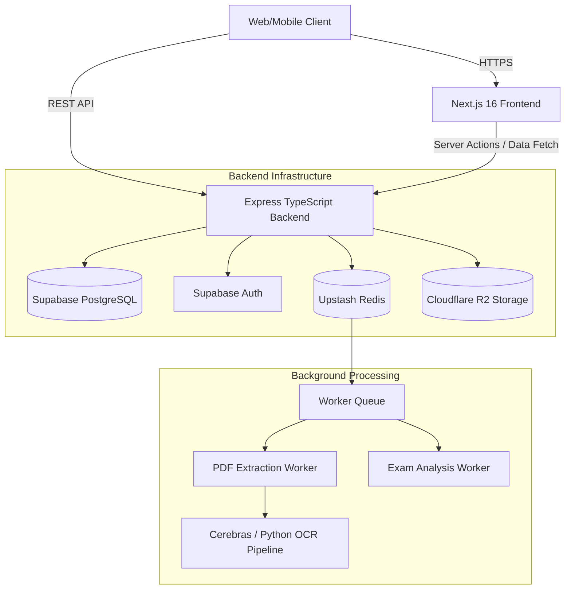

<div align="center">
  
  <h1>Classphere</h1>
  <p><b>The B2B SaaS Test Prep Platform for JEE, NEET, and Beyond</b></p>
  <!-- Last updated: 2026-07-27 — AI PDF Extraction Pipeline v4 -->
</div>

---

Classphere is a modern, highly-scalable platform built for educational institutes to conduct, manage, and analyze competitive exams (JEE Main, JEE Advanced, NEET). It offers a white-labeled, multi-tenant environment for institutes and robust AI-powered tools for generating mock tests, managing student batches, and delivering deep analytics.

This repository is a [Turborepo](https://turbo.build/) monorepo containing the web frontend, backend API, shared types, and mobile configurations.

---

## 🏗 System Architecture

Classphere is structured as a decoupled monorepo. It features a Next.js (App Router) frontend that handles both superadmin and multi-tenant domain routing, and a highly modular Express + TypeScript API.



### 📦 Repository Structure

The project is structured into `apps` and `packages`.

```text
classphere/
├── apps/
│   ├── api/                 # Express backend, Background Workers, Python extractors
│   └── web/                 # Next.js 16 App Router, Tailwind v4, Capacitor Android
├── packages/
│   ├── types/               # Shared TypeScript definitions (DB schema, API payloads)
│   ├── eslint-config/       # Shared linting rules
│   └── tsconfig/            # Shared TypeScript configurations
├── docs/                    # Architecture deep-dives and SQL migrations
└── package.json             # Root workspace definitions
```

---

## 🛠 Tech Stack

### Frontend (`apps/web`)
- **Framework:** Next.js 16 (App Router)
- **UI & Styling:** React 19, Tailwind CSS v4, Lucide React
- **Math Rendering:** KaTeX, MathLive (for math input keyboards)
- **Data Visualization:** Recharts
- **Mobile App:** Capacitor (Android output built from the web codebase)
- **Multi-tenancy:** Handled via Next.js middleware using the `[domain]` folder structure.

### Backend (`apps/api`)
- **Core:** Node.js, Express, TypeScript
- **Modularity:** Domain-driven structure (`src/modules/*`)
- **Database & Auth:** Supabase (PostgreSQL with Row Level Security)
- **Background Jobs:** BullMQ backed by Upstash Redis. Processes PDF generation and AI extraction asynchronously.
- **File Storage:** Cloudflare R2 (compatible with S3)
- **AI Extraction:** Python-based pipeline using `PyMuPDF` (marker extraction) and `Cerebras Cloud SDK` for high-speed, LLM-based OCR.

---

## 🚀 Core Features & Modules

### 1. Multi-Tenant Subdomain Routing
Institutes access their own white-labeled portals via `[institute].classphere.com`. Next.js Middleware maps incoming domain requests to the `app/[domain]` folder, securely injecting the tenant context into API requests.

### 2. AI PDF to Question Pipeline (Superadmin & Test Admin)
The platform handles raw PDF test uploads and uses AI to extract structured questions:
1. **Upload:** User uploads a PDF (up to 50MB).
2. **Queue:** The API pushes the file to Cloudflare R2 and enqueues a BullMQ job to avoid HTTP timeouts.
3. **Extraction:** An isolated Node worker spawns a Python process, reads the PDF via PyMuPDF, and feeds it to Cerebras AI for high-speed structured extraction.
4. **Polling:** The frontend polls via Server-Sent Events (SSE) or simple GET loops until the questions are ready.

### 3. Deep Analysis Engine
Every student attempt is processed by the background `analysis.worker.ts`. It generates insights such as:
- Subject and Chapter-wise accuracy.
- Time management (time spent on correct vs. incorrect answers).
- Peer comparison and percentile rankings.

### 4. Robust RBAC (Role-Based Access Control)
Supabase handles the JWTs, while the Express API uses strict middleware (`requireRole('super_admin')`, etc.) and Row-Level Security (RLS) policies in PostgreSQL to ensure an institute admin cannot access another institute's data.

---

## 💻 Developer Setup & Running Locally

### Prerequisites
1. **Node.js:** v22+ (the Dockerfile and `engines` pin Node 22)
2. **Python:** v3.11+ (for the PDF extraction pipeline)
3. **npm:** v10+

### 1. Environment Variables
Create `.env` files in both the API and Web roots by copying `.env.example`.
Key variables needed:
- `SUPABASE_URL` and `SUPABASE_ANON_KEY` / `SUPABASE_SERVICE_KEY`
- `REDIS_URL` (Upstash)
- `CEREBRAS_API_KEY` (or via `apps/api/src/services/extractor/api_keys.txt`)
- `CLOUDFLARE_R2_ACCESS_KEY_ID`, etc.

### 2. Installation
Install all monorepo dependencies from the root:
```bash
npm install
```

### 3. Start Development Servers
You can spin up both the Next.js frontend and Express API simultaneously using Turborepo:
```bash
npm run dev
```

- **Frontend:** `http://localhost:3000` (Access local tenants via `http://[slug].localhost:3000`)
- **Backend:** `http://localhost:3001`

### 4. Background Workers
By default, the Express server in development will spawn background workers in the same process if `START_WORKERS=true` is present in the `.env` file. In production, these should ideally be scaled as separate Node processes (e.g., `npm run worker:start`).

---

## 🔒 Security Practices

- **API Keys are not committed:** Cerebras and Supabase keys must remain in your local `.env` or in the `.gitignore`'d `api_keys.txt`.
- **Row Level Security (RLS):** Enabled on all Supabase tables. Database logic strictly enforces isolation between `institutes`.
- **Rate Limiting:** Enforced via `express-rate-limit` on expensive endpoints (e.g., `/extract-pdf`).
- **Sentry Logging:** Integrated into both the Next.js frontend and the Express backend for realtime error capturing and performance profiling.

---

## 📚 Further Documentation

For deeper dives into specific technical implementations, see the `docs/` folder or the root markdown files:

- [ARCHITECTURE_V2.md](./ARCHITECTURE_V2.md) — Comprehensive view of the module structure and design patterns.
- [SYSTEM_DESIGN_V2.md](./SYSTEM_DESIGN_V2.md) — System boundaries, database relationships, and API design.
- [DEVELOPER_GUIDE.md](./DEVELOPER_GUIDE.md) — Onboarding instructions, coding standards, and common patterns.
