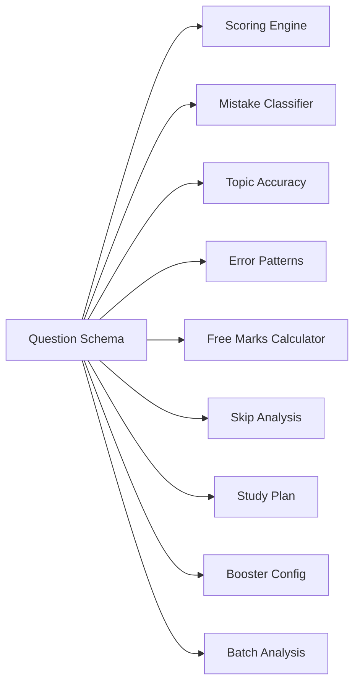

# Question Schema: Gap Analysis & Transformation Plan

## The Core Relationship

You're right — **the analysis engine's quality is directly limited by the data in the questions**. Here's the dependency chain:



Every single stage of the analysis engine reads from the question data. If the question doesn't have `subject`, `chapter`, `topic`, `difficulty`, or `distractor_map` — those stages either break or produce garbage.

---

## Current Schema (Your JSON)

Here's what a question in `Mock Test 4 (Paper 2).json` actually looks like:

```json
{
    "id": null,
    "question_text": 1,
    "image_url": { "g": "Two identical uniform cylinders..." },
    "options": { "a": "...", "g": "...", "h": "...", "k": "..." },
    "section_or_subject": "Consider a moment when the center...",
    "answer_key": [0, 2],
    "question_type": "Multiple Correct"
}
```

## What the Analysis Engine Needs (from Blueprint + IDEA.md)

```json
{
    "id": "uuid",
    "question_text": "Full text of the question",
    "image_url": "https://...",
    "options": [
        { "id": "A", "text": "...", "image_url": null },
        { "id": "B", "text": "...", "image_url": null },
        { "id": "C", "text": "...", "image_url": null },
        { "id": "D", "text": "...", "image_url": null }
    ],
    "correct_answer": ["A", "C"],
    "explanation": "Detailed solution...",
    "question_type": "mcq_multi",
    "subject": "Physics",
    "chapter": "Mechanics",
    "topic": "Rolling Motion",
    "difficulty": "hard",
    "source": "Mock Test 4 Paper 2",
    "year": null,
    "tags": ["cylinders", "collision", "constraint-equations"],
    "distractor_map": {
        "B": { "error_type": "partial_solve", "trap_description": "...", "common_mistake": "..." },
        "D": { "error_type": "sign_error", "trap_description": "...", "common_mistake": "..." }
    },
    "marking_scheme": { "correct": 4, "incorrect": -1, "unattempted": 0, "partial": true }
}
```

---

## Gap Analysis: Field-by-Field

| # | Field | Current State | What's Needed | Impact if Missing |
|---|---|---|---|---|
| 1 | `id` | Always `null` | UUID per question | 🔴 Cannot track question exposure, dedup for boosters |
| 2 | `question_text` | Just a **number** (1, 2, 3...) | Actual question text (or at minimum the question number within the test) | 🟡 The actual text is inside `image_url.g` |
| 3 | `image_url` | Object `{ "g": "text + HTML img tags" }` | Clean string or null; question body should be separate | 🔴 Parsing nightmare — question text, images, and LaTeX all mashed together |
| 4 | `options` | Keys are `a, g, h, k` (non-standard) | Array of `{id, text}` or keys `A, B, C, D` | 🔴 Answer key uses indices 0-3 but options use `a,g,h,k` — mapping is implicit |
| 5 | `section_or_subject` | Contains the **solution/explanation**, NOT section/subject | Separate `explanation` field; actual `subject` field needed | 🔴 Engine needs `subject` for skip analysis, batch analysis, subject avoidance detection |
| 6 | `answer_key` | Array of indices `[0, 2]` for MCQ; string `"3.2"` for numerical | Normalized: array of option IDs for MCQ, number for numerical | 🟡 Workable but fragile — what do 0,1,2,3 map to? |
| 7 | `question_type` | `"Multiple Correct"`, `"Single Correct"`, `"Numerical"` | Enum: `mcq_single`, `mcq_multi`, `integer` | 🟡 Just needs renaming |
| 8 | `subject` | ❌ MISSING | Required: `"Physics"`, `"Chemistry"`, `"Mathematics"` | 🔴 **Topic accuracy, batch heatmap, skip analysis, study plan ALL break** |
| 9 | `chapter` | ❌ MISSING | Required: e.g. `"Mechanics"`, `"Thermodynamics"` | 🔴 **Weak area identification, booster config, study plan ALL break** |
| 10 | `topic` | ❌ MISSING | Required: e.g. `"Rolling Motion"`, `"Carnot Cycle"` | 🔴 **Granular analysis impossible** |
| 11 | `difficulty` | ❌ MISSING | Required: `easy`, `medium`, `hard` | 🔴 **Free marks calculator, heuristic classifier, booster difficulty mix ALL break** |
| 12 | `distractor_map` | ❌ MISSING | Optional but high-value: maps wrong options to error types | 🟡 Classifier falls back to heuristics (70% accuracy instead of 90%) |
| 13 | `explanation` | Exists but stored in `section_or_subject` | Needs its own dedicated field | 🟡 Just needs renaming/moving |
| 14 | `marking_scheme` | ❌ MISSING per question | Needed for partial marking in MCQ Multi | 🟡 Can default from test-level config |

---

## Critical Issues Summary

> [!CAUTION]
> ### 3 Showstoppers (Engine cannot function without these)
> 1. **No `subject`** — Cannot group by Physics/Chemistry/Maths
> 2. **No `chapter`** — Cannot identify weak chapters or generate study plans
> 3. **No `topic`** — Cannot do granular analysis or generate targeted boosters

> [!WARNING]
> ### 3 Major Issues (Engine works but poorly)
> 4. **No `difficulty`** — Free marks calculator and heuristic classifier are neutered
> 5. **No `id` (UUID)** — Cannot track question exposure across booster chains
> 6. **`image_url.g` contains the entire question body** — Parsing is brittle

> [!NOTE]
> ### 4 Minor Issues (Cosmetic / easy fixes)
> 7. Option keys `a,g,h,k` instead of `A,B,C,D` — just a mapping
> 8. `question_type` naming — just rename
> 9. `section_or_subject` is really `explanation` — just rename
> 10. `answer_key` format inconsistency between MCQ and Numerical — normalize

---

## Proposed Enriched Question Schema

This is what each question should look like after transformation:

```typescript
interface Question {
  // Identity
  id: string;                          // UUID — auto-generated if null
  question_number: number;             // Original number (1, 2, 3...)

  // Content
  question_text: string;               // The actual question body (extracted from image_url.g)
  question_images: string[];           // Extracted image URLs from  tags
  options: Option[];                   // Normalized option array
  correct_answer: string[] | number;   // Option IDs for MCQ, number for Numerical
  explanation: string;                 // Solution (moved from section_or_subject)
  explanation_images: string[];        // Images in the explanation

  // Classification (THE CRITICAL ADDITIONS)
  subject: string;                     // "Physics" | "Chemistry" | "Mathematics"
  chapter: string;                     // "Mechanics" | "Optics" | etc.
  topic: string;                       // "Rolling Motion" | "Snell's Law" | etc.
  difficulty: "easy" | "medium" | "hard";

  // Metadata
  question_type: "mcq_single" | "mcq_multi" | "integer";
  source: string;                      // "Mock Test 4 (Paper 2)"
  year: number | null;
  tags: string[];

  // Analysis Engine Support (optional, teacher-tagged)
  distractor_map?: Record<string, {
    error_type: string;
    trap_description: string;
    common_mistake: string;
  }>;

  // Exam config
  marking_scheme: {
    correct: number;       // +4
    incorrect: number;     // -1
    unattempted: number;   // 0
    partial: boolean;      // true for MCQ Multi in JEE Adv
  };
}

interface Option {
  id: string;        // "A", "B", "C", "D"
  text: string;      // Option content (LaTeX/HTML)
  image_url?: string; // If option is an image
}
```

---

## Your Question Set: What Needs to Be Done

### Structure of Mock Test 4 (Paper 2)

From analyzing the 54 questions:

| Range | Subject | Question Types |
|---|---|---|
| Q1–Q18 | Mixed (Q1-8: Physics, Q9-14: Physics, Q15-18: Physics/EM) | MCQ Multi (1-8), Numerical (9-14), Single+Linked (15-18) |
| Q19–Q36 | Chemistry | MCQ Multi (19-26), Numerical (27-32), Single+Linked (33-36) |
| Q37–Q54 | Mathematics | MCQ Multi (37-44), Numerical (45-50), Single+Linked (51-54) |

> [!IMPORTANT]
> This is a **JEE Advanced Paper 2** format. The question distribution follows the standard JEE Advanced pattern:
> - 18 questions per subject (Physics, Chemistry, Mathematics)
> - Mix of Multiple Correct, Numerical, and Linked Comprehension questions
> - Marking: +4/-2 for MCQ Multi (partial: +1 per correct, no negative for partial), +3/0 for Numerical, +3/-1 for Single Correct

---

## Proposed Changes — Summary

### Phase 1: Schema Transformation (Automated)
1. **Generate UUIDs** for each question
2. **Extract question text** from `image_url.g` (separate text from `` tags)
3. **Normalize options** from `{a, g, h, k}` → `[{id: "A", text: "..."}, ...]`
4. **Normalize answer_key** — map indices to option IDs
5. **Move `section_or_subject`** → `explanation`
6. **Rename `question_type`** values

### Phase 2: Manual Enrichment (Requires Domain Knowledge)
7. **Tag `subject`** — can be auto-detected from question ranges (Q1-18=Physics, Q19-36=Chemistry, Q37-54=Mathematics)
8. **Tag `chapter`** — needs manual review or LLM-assisted tagging
9. **Tag `topic`** — needs manual review or LLM-assisted tagging
10. **Tag `difficulty`** — needs manual review (or heuristic: JEE Adv = mostly "hard", some "medium")

### Phase 3: Analysis Engine Enhancement (Optional, Future)
11. **Add `distractor_map`** — teacher-authored for high-confidence mistake classification
12. **Add `marking_scheme`** per question — based on JEE Advanced rules

---

## Open Questions

> [!IMPORTANT]
> ### Questions that need your input before proceeding:

1. **Do you have more question sets?** Is this the only JSON, or are there more mock tests? The transformation script should handle all of them.

2. **Subject detection**: For this test, I can auto-tag subjects based on question number ranges (1-18 = Physics, 19-36 = Chemistry, 37-54 = Maths). Is this pattern consistent across all your question sets?

3. **Chapter/Topic tagging**: This is the hardest part. Two options:
   - **(A) Manual**: You go through and tag each question's chapter and topic — most accurate
   - **(B) LLM-assisted**: We use an LLM to analyze the question text and auto-tag chapter/topic — faster but needs verification
   - **(C) Hybrid**: Auto-tag with LLM, you verify and correct
   
   Which approach do you prefer?

4. **Difficulty tagging**: Same question — manual or heuristic-based? For JEE Advanced, a reasonable default is `"hard"` for all, but granularity helps the engine.

5. **Marking scheme**: JEE Advanced Paper 2 has different marks for different question types:
   - Multiple Correct: +4 full, +1 per correct option (partial), -2 for any wrong
   - Numerical: +3, 0
   - Single Correct (linked): +3, -1
   
   Should we store this at the question level or at the test config level?

6. **Option key mapping**: Your current options use keys `a, g, h, k`. The `answer_key` uses indices `[0, 1, 2, 3]`. I'm assuming `a=0, g=1, h=2, k=3`. Is that correct?

7. **Where should transformed questions live?** Options:
   - Same directory, new filename (e.g., `mock_test_4_paper_2_enriched.json`)
   - A dedicated `data/questions/` directory
   - Directly into the database seeding script

---

## Verification Plan

### Automated Tests
- Schema validation: every transformed question passes Zod schema
- Answer key integrity: verify correct_answer maps correctly to options
- Completeness: no null subjects/chapters in output

### Manual Verification
- Spot-check 5 questions per subject for correct chapter/topic tagging
- Verify marking scheme matches JEE Advanced Paper 2 format
